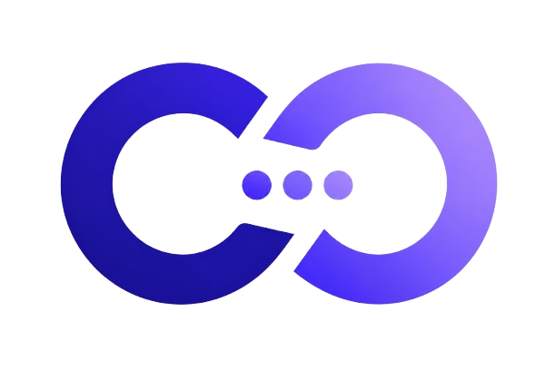

# ClientOra

<div align="center">
  
  
  <h3>Modern Client & Workspace Management Platform</h3>
  
  <p>Streamline clients, projects, meetings, team collaborations, and billing invoices in one unified workspace.</p>

  <p>
    <a href="[https://useclientora.vercel.app](https://useclientora.vercel.app)" target="_blank">
      
    </a>
  </p>
</div>

---

## 📌 Overview

**ClientOra** is an all-in-one client relationship and workspace management platform designed for freelancers, agencies, and teams. It simplifies workflow coordination by bringing client tracking, active project status, meeting scheduling, team onboarding/invitations, and invoice generation into a centralized, modern interface.

---

## ✨ Features

* **🏢 Multi-Workspace Support:** Organize teams, roles (Owner, Admin, Member), and projects within dedicated workspaces.
* **👥 Client Management:** Comprehensive CRM to maintain client contacts, communication records, and associated deliverables.
* **📊 Project Tracking:** Monitor real-time status, milestones, and project health.
* **✉️ Dynamic Team Invites:** Invite collaborators via automated transactional emails with workspace-level role assignments.
* **📅 Meeting Scheduling & Notifications:** Coordinate client and team syncs with automated meeting reminders.
* **🧾 Invoice & Billing Generation:** Track billable work, generate client invoices, and monitor payment statuses.
* **🔐 Secure Authentication & Access Control:** Powered by Supabase Auth with Row-Level Security (RLS) policies.
* **🎨 Modern Responsive UI:** Built with Tailwind CSS, Lucide icons, and full dark/light theme support.

---

## 🛠️ Tech Stack

* **Framework:** [Next.js](https://nextjs.org/) (App Router, TypeScript)
* **Styling:** [Tailwind CSS](https://tailwindcss.com/)
* **Database & Auth:** [Supabase](https://supabase.com/) (PostgreSQL, Row-Level Security, Supabase Auth)
* **Email Delivery:** Nodemailer / Supabase Auth SMTP (Gmail SMTP)
* **Deployment:** [Vercel](https://vercel.com/)

---

## 🚀 Getting Started

### Prerequisites

Ensure you have the following installed locally:
* [Node.js](https://nodejs.org/) (v18.x or higher)
* [npm](https://www.npmjs.com/) or [pnpm](https://pnpm.io/) or [yarn](https://yarnpkg.com/)
* A [Supabase](https://supabase.com/) project

---

### 1. Clone the Repository

```bash
git clone https://github.com/samanthaheartmatiga/clientora.git
cd clientora

```

### 2. Install Dependencies

```bash
npm install

```

### 3. Configure Environment Variables

Create a `.env.local` file in the root directory and add the following keys:

```env
# Supabase Configuration
NEXT_PUBLIC_SUPABASE_URL=your_supabase_project_url
NEXT_PUBLIC_SUPABASE_ANON_KEY=your_supabase_anon_key
SUPABASE_SERVICE_ROLE_KEY=your_supabase_service_role_key

# Application URL
NEXT_PUBLIC_APP_URL=http://localhost:3000

# Email Configuration (SMTP)
GMAIL_USER=your_email@gmail.com
GMAIL_APP_PASS=your_16_character_google_app_password

```

### 4. Run the Development Server

```bash
npm run dev

```

Open [http://localhost:3000](http://localhost:3000) in your browser to view the application.

---

## 📁 Project Structure

```text
clientora/
├── app/                  # Next.js App Router (pages, layouts, API routes)
│   ├── api/              # Serverless API endpoints (invite, mail, callbacks)
│   ├── auth/             # Authentication & verification routes
│   ├── clients/          # Client CRM views
│   ├── invoices/         # Billing & invoice management
│   ├── join/             # Workspace invitation acceptance
│   ├── meetings/         # Calendar & scheduling
│   ├── projects/         # Project tracking boards
│   └── settings/         # Workspace and profile configurations
├── components/           # Reusable UI and layout components
├── context/              # React context providers (Auth, Workspace, Theme)
├── hooks/                # Custom React hooks
├── lib/                  # Supabase clients and helper utilities
├── public/               # Static assets & brand media
├── types/                # TypeScript type definitions and DB schemas
└── ...config files

```

---

## 🔒 Security & Best Practices

* **Row-Level Security (RLS):** All Supabase database tables enforce strict RLS policies to ensure tenant data isolation between different workspaces.
* **Service Role Protection:** Elevated admin operations (e.g., automated workspace user invitations) run strictly within secure server-side API routes.

---

## 🚢 Deployment

ClientOra is deployed and hosted on **Vercel**:

1. Continuous deployment is connected to the `main` branch.
2. Production environment variables are securely stored in the Vercel dashboard.
3. Supabase Auth URLs are mapped to `[https://useclientora.vercel.app](https://useclientora.vercel.app)`.


